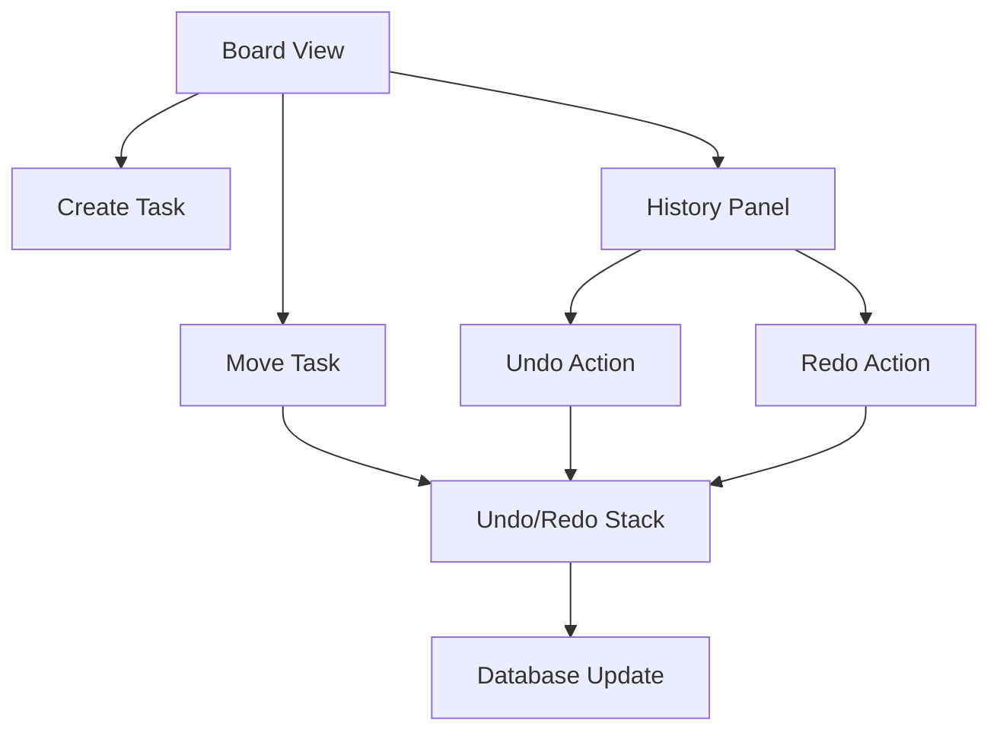

## 1. Product Overview

A collaborative task management board that enables teams to organize and track tasks across different stages with full undo/redo functionality. Users can move tasks between columns (To-Do, In Progress, Completed) and revert changes when needed.

The product solves the problem of task tracking in collaborative environments while providing safety through undo/redo capabilities, making it ideal for teams who need reliable task management with change history.

## 2. Core Features

### 2.1 User Roles

| Role        | Registration Method      | Core Permissions                      |
| ----------- | ------------------------ | ------------------------------------- |
| Team Member | Email registration       | Create, move, and edit tasks          |
| Team Admin  | Admin invitation         | Full task management, user management |
| Guest User  | No registration required | View-only access to public boards     |

### 2.2 Feature Module

Our collaborative task board consists of the following main pages:

1. **Board View**: Main task board with three columns (To-Do, In Progress, Completed)
2. **Task Management**: Create, edit, and delete tasks with drag-and-drop functionality
3. **History Panel**: View recent actions and access undo/redo controls

### 2.3 Page Details

| Page Name       | Module Name    | Feature description                                           |
| --------------- | -------------- | ------------------------------------------------------------- |
| Board View      | Task Columns   | Display three vertical columns with tasks organized by status |
| Board View      | Task Cards     | Show task title, description, and assignee information        |
| Board View      | Drag & Drop    | Move tasks between columns with visual feedback               |
| Task Management | Create Task    | Add new tasks with title, description, and initial status     |
| Task Management | Edit Task      | Modify task details inline or via modal dialog                |
| Task Management | Delete Task    | Remove tasks with confirmation prompt                         |
| History Panel   | Undo Button    | Revert the last action performed on the board                 |
| History Panel   | Redo Button    | Re-apply previously undone actions                            |
| History Panel   | Action History | Display list of recent actions with timestamps                |

## 3. Core Process

### Team Member Flow

1. User accesses the board and sees tasks organized in three columns
2. User creates new tasks by clicking "Add Task" button
3. User moves tasks between columns by drag-and-drop or clicking move buttons
4. User can undo accidental moves using the undo button
5. User can redo actions if they undid something by mistake
6. All changes are automatically saved to the database

### Admin Flow

1. Admin has all team member capabilities
2. Admin can manage user permissions and board access
3. Admin can view complete action history for all users

## 4. User Interface Design

### 4.1 Design Style

* **Primary Colors**: Indigo (#4F46E5) for primary actions, Emerald (#10B981) for completed tasks
* **Secondary Colors**: Zinc (#71717A) for secondary text, Zinc (#F4F4F5) for backgrounds
* **Button Style**: Modern, clean buttons with subtle hover effects and rounded corners
* **Font**: Inter/Sans-serif (Modern, clean) with responsive typography
* **Layout Style**: Card-based, minimalist design with clear visual hierarchy
* **Icons**: Lucide React icons for a consistent modern look

### 4.2 Page Design Overview

| Page Name     | Module Name       | UI Elements                                                                                |
| ------------- | ----------------- | ------------------------------------------------------------------------------------------ |
| Board View    | Task Columns      | Three vertical columns with distinct color coding, column headers with task counts         |
| Board View    | Task Cards        | White cards with rounded corners, drop shadows, title in bold, description in regular text |
| Board View    | Drag & Drop       | Visual feedback with opacity changes, drop zone highlighting                               |
| History Panel | Undo/Redo Buttons | Large prominent buttons with keyboard shortcut hints, disabled state styling               |
| History Panel | Action List       | Scrollable list with timestamps, user avatars, and action descriptions                     |

### 4.3 Responsiveness

Desktop-first design with mobile adaptation. The layout automatically adjusts to single column on mobile devices while maintaining full functionality. Touch interactions are optimized for mobile users with larger tap targets and swipe gestures.

### 4.4 Command Pattern Implementation

The undo/redo functionality is implemented using the Command Pattern with visual feedback:

* Each user action creates a command object

* Commands are stored in undo/redo stacks

* Visual indicators show when actions are recorded

* Stack depth limited to prevent memory issues

