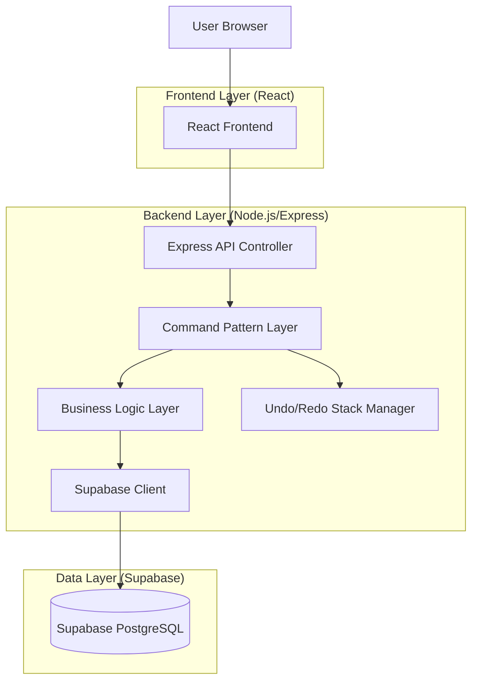
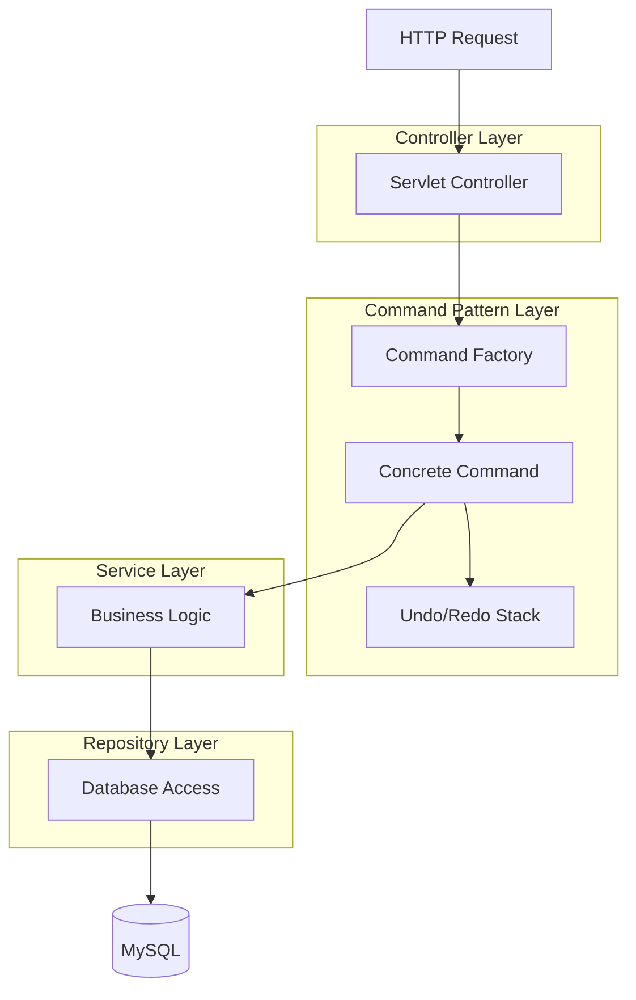
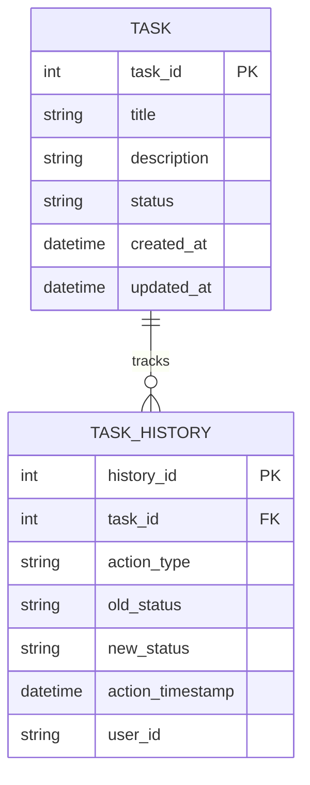

## 1. Architecture Design



## 2. Technology Description

* **Frontend**: React 18 + TypeScript + Tailwind CSS
* **Backend**: Node.js + Express + TypeScript
* **Database**: Supabase (PostgreSQL)
* **State Management**: Zustand
* **Icons**: Lucide React
* **Build Tool**: Vite
* **Command Pattern**: TypeScript implementation for undo/redo functionality

## 3. Route Definitions

| Route           | Purpose                              |
| --------------- | ------------------------------------ |
| /               | Main board view displaying all tasks |
| /api/tasks      | CRUD operations for tasks            |
| /api/tasks/move | Move task between columns            |
| /api/undo       | Undo last action                     |
| /api/redo       | Redo previously undone action        |
| /api/history    | Get recent action history            |

## 4. API Definitions

### 4.1 Task Management API

**Create Task**

```
POST /api/tasks
```

Request:

| Param Name  | Param Type | isRequired | Description                         |
| :---------- | :--------- | :--------- | :---------------------------------- |
| title       | string     | true       | Task title                          |
| description | string     | false      | Task description                    |
| status      | string     | true       | Initial status (todo/progress/done) |

Response:

| Param Name | Param Type | Description            |
| ---------- | ---------- | ---------------------- |
| taskId     | integer    | Unique task identifier |
| status     | string     | Creation status        |

**Move Task**

```
POST /api/tasks/move
```

Request:

| Param Name | Param Type | isRequired | Description                        |
| ---------- | ---------- | ---------- | ---------------------------------- |
| taskId     | integer    | true       | Task identifier                    |
| newStatus  | string     | true       | Target status (todo/progress/done) |

Response:

| Param Name | Param Type | Description                      |
| ---------- | ---------- | -------------------------------- |
| success    | boolean    | Move operation status            |
| commandId  | string     | Command identifier for undo/redo |

### 4.2 Undo/Redo API

**Undo Action**

```
POST /api/undo
```

Response:

| Param Name   | Param Type | Description              |
| :----------- | :--------- | :----------------------- |
| success      | boolean    | Undo operation status    |
| undoneAction | object     | Details of undone action |

**Redo Action**

```
POST /api/redo
```

Response:

| Param Name   | Param Type | Description              |
| ------------ | ---------- | ------------------------ |
| success      | boolean    | Redo operation status    |
| redoneAction | object     | Details of redone action |

## 5. Server Architecture Diagram



## 6. Data Model

### 6.1 Data Model Definition



### 6.2 Data Definition Language

**Tasks Table**

```sql
CREATE TABLE tasks (
    task_id INT PRIMARY KEY AUTO_INCREMENT,
    title VARCHAR(255) NOT NULL,
    description TEXT,
    status ENUM('todo', 'progress', 'done') DEFAULT 'todo',
    created_at TIMESTAMP DEFAULT CURRENT_TIMESTAMP,
    updated_at TIMESTAMP DEFAULT CURRENT_TIMESTAMP ON UPDATE CURRENT_TIMESTAMP,
    INDEX idx_status (status),
    INDEX idx_created_at (created_at)
);
```

**Task History Table**

```sql
CREATE TABLE task_history (
    history_id INT PRIMARY KEY AUTO_INCREMENT,
    task_id INT NOT NULL,
    action_type VARCHAR(50) NOT NULL,
    old_status VARCHAR(50),
    new_status VARCHAR(50),
    action_timestamp TIMESTAMP DEFAULT CURRENT_TIMESTAMP,
    user_id VARCHAR(100),
    FOREIGN KEY (task_id) REFERENCES tasks(task_id),
    INDEX idx_task_id (task_id),
    INDEX idx_action_timestamp (action_timestamp)
);
```

### 6.3 Command Pattern Implementation

**Command Interface**

```typescript
export interface Command {
  execute(): Promise<void>;
  undo(): Promise<void>;
  id: string;
  description: string;
  timestamp: number;
}
```

**Move Task Command**

```typescript
export class MoveTaskCommand implements Command {
  id: string;
  description: string;
  timestamp: number;
  private taskId: number;
  private oldStatus: string;
  private newStatus: string;
  private taskService: TaskService;

  constructor(taskId: number, oldStatus: string, newStatus: string, taskService: TaskService) {
    this.id = crypto.randomUUID();
    this.taskId = taskId;
    this.oldStatus = oldStatus;
    this.newStatus = newStatus;
    this.taskService = taskService;
    this.description = `Moved task ${taskId} from ${oldStatus} to ${newStatus}`;
    this.timestamp = Date.now();
  }

  async execute() {
    await this.taskService.updateTaskStatus(this.taskId, this.newStatus);
  }

  async undo() {
    await this.taskService.updateTaskStatus(this.taskId, this.oldStatus);
  }
}
```

### 6.4 Supabase Client Configuration

**Supabase Configuration**

```typescript
import { createClient } from '@supabase/supabase-js'

const supabaseUrl = process.env.SUPABASE_URL
const supabaseKey = process.env.SUPABASE_ANON_KEY

export const supabase = createClient(supabaseUrl, supabaseKey)
```

