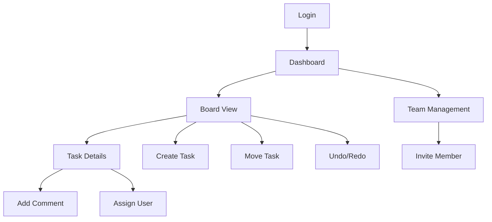

## 1. Product Overview
A collaborative task board application that enables teams to manage tasks with real-time collaboration and full undo/redo functionality. The system bridges Java backend logic with MySQL database and web-based frontend to provide seamless task management experience.

This product solves the problem of team coordination by allowing multiple users to work on the same task board simultaneously while maintaining data integrity through undo/redo capabilities. Teams can track progress, assign tasks, and revert changes when needed.

## 2. Core Features

### 2.1 User Roles
| Role | Registration Method | Core Permissions |
|------|---------------------|------------------|
| Team Member | Email registration | Create, edit, delete own tasks; view team boards |
| Team Admin | Email registration with admin privilege | Full board management, user management, all task operations |
| Guest User | View-only access | View public boards, no edit permissions |

### 2.2 Feature Module
Our collaborative task board consists of the following main pages:
1. **Dashboard**: Overview of all boards, quick access to recent boards, team activity feed
2. **Board View**: Kanban-style task board with drag-and-drop, task cards, columns management
3. **Task Details**: Individual task view with comments, attachments, assignees, and history
4. **User Profile**: Personal settings, notification preferences, activity history
5. **Team Management**: Member invitation, role assignment, team settings

### 2.3 Page Details
| Page Name | Module Name | Feature description |
|-----------|-------------|---------------------|
| Dashboard | Board List | Display all accessible boards with preview, last modified timestamp, and member count |
| Dashboard | Activity Feed | Show recent team activities including task updates, comments, and member joins |
| Dashboard | Quick Actions | Create new board, invite team members, access recent tasks |
| Board View | Kanban Board | Drag-and-drop tasks between columns, real-time updates for all collaborators |
| Board View | Task Cards | Display task title, assignee, due date, priority level with color coding |
| Board View | Column Management | Add, rename, delete columns; set WIP limits; customize column colors |
| Board View | Undo/Redo Bar | Show action history, allow reverting last 50 actions with visual feedback |
| Task Details | Task Information | Edit title, description, due date, priority, tags, and custom fields |
| Task Details | Comments | Add threaded comments, mention team members, attach files |
| Task Details | Assignees | Assign multiple users, set primary assignee, show workload indicators |
| Task Details | History | View complete change log with timestamps and user attribution |
| User Profile | Personal Info | Update name, email, avatar, timezone, and notification settings |
| User Profile | Activity History | View personal task activities across all boards with filtering options |
| Team Management | Member List | View all team members, their roles, last active time, and board access |
| Team Management | Invitations | Send email invitations, manage pending invites, set default permissions |

## 3. Core Process
**User Workflow:**
1. User logs in and lands on Dashboard showing their boards
2. User selects a board to open the Kanban view
3. User can create tasks, move them between columns, and collaborate with team members
4. All actions are tracked and can be undone/redone using the history bar
5. Users can access task details for deeper collaboration and file sharing

**Collaboration Flow:**
1. Multiple users can work on the same board simultaneously
2. Changes are synchronized in real-time across all connected clients
3. Conflict resolution handles simultaneous edits gracefully
4. Undo/redo maintains consistency across all users' views

**Undo/Redo Process:**
1. Every user action creates an entry in the action history
2. Users can undo up to 50 recent actions
3. Redo is available after undo operations
4. System maintains data integrity during undo/redo operations

## 4. User Interface Design

### 4.1 Design Style
- **Primary Colors**: Deep blue (#2563eb) for primary actions, light gray (#f3f4f6) for backgrounds
- **Secondary Colors**: Green (#10b981) for success states, red (#ef4444) for deletions
- **Button Style**: Rounded corners (8px radius), subtle shadows, hover animations
- **Typography**: Inter font family, 14px base size, clear hierarchy with font weights
- **Layout**: Card-based design with consistent spacing (8px grid system)
- **Icons**: Feather icons for consistency, emoji support for task titles and comments

### 4.2 Page Design Overview
| Page Name | Module Name | UI Elements |
|-----------|-------------|-------------|
| Dashboard | Board List | Grid layout with 3-column responsive cards, hover effects, progress indicators |
| Dashboard | Activity Feed | Timeline-style feed with user avatars, timestamps, and action types |
| Board View | Kanban Board | Horizontal scrollable columns, drag-and-drop visual feedback, column headers with counters |
| Board View | Task Cards | Rounded rectangles with priority color borders, assignee avatars, due date badges |
| Board View | Undo/Redo Bar | Floating bar at bottom with action preview, keyboard shortcuts displayed |
| Task Details | Modal View | Overlay modal with tabs for details, comments, history, and attachments |
| User Profile | Settings Panel | Two-column layout with form inputs on right, preview on left |

### 4.3 Responsiveness
Desktop-first design approach with mobile responsiveness:
- Desktop: Full Kanban board with all columns visible
- Tablet: Collapsible sidebar, adjusted column widths
- Mobile: Single column view with swipe navigation between columns
- Touch optimization for drag-and-drop on mobile devices

### 4.4 Real-time Collaboration Features
- WebSocket integration for instant updates across clients
- Visual indicators for users currently viewing/editing tasks
- Conflict resolution UI for simultaneous edits
- Smooth animations for task movements and updates