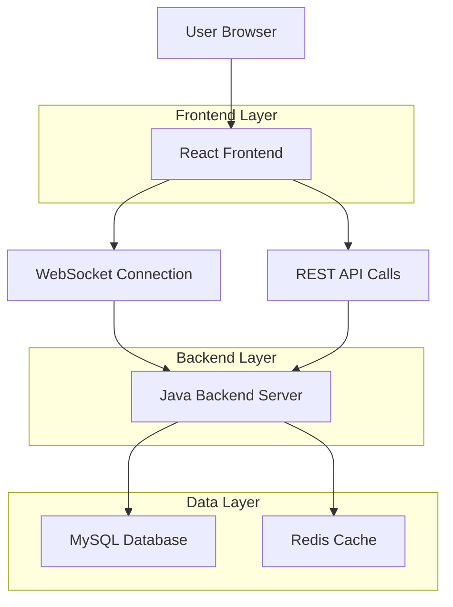

## 1. Architecture design



## 2. Technology Description
- Frontend: React@18 + tailwindcss@3 + vite
- Initialization Tool: vite-init
- Backend: Java Spring Boot@3.2 + Maven
- Database: MySQL@8.0
- Cache: Redis@7.0
- Real-time: WebSocket with STOMP protocol
- Build Tool: Maven (backend), npm (frontend)

## 3. Route definitions
| Route | Purpose |
|-------|---------|
| / | Dashboard page, displays all user boards |
| /board/:id | Board view page, shows Kanban board for specific board |
| /task/:id | Task details page, shows individual task information |
| /profile | User profile page, manages personal settings |
| /team | Team management page, handles team members and permissions |
| /login | Login page, user authentication |
| /register | Registration page, new user signup |

## 4. API definitions

### 4.1 Authentication APIs
```
POST /api/auth/login
```

Request:
| Param Name | Param Type | isRequired | Description |
|------------|-------------|-------------|-------------|
| email | string | true | User email address |
| password |